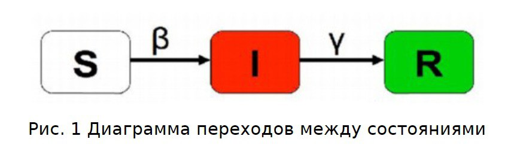
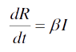
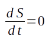

---
## Front matter
lang: ru-RU
title: Групповой проект номер №5
subtitle: Дисциплина "Научное программирование"
author:
  - Супонина Анастасия Павловна,
  - Лобов Михаил Сергеевич,
  - Нирдоши Всеволод Раджендер
institute:
  - Кафедра теории вероятностей и кибербезопасности
  - Российский университет дружбы народов имени Патриса Лумумбы, Москва, Россия
date: 05 Октября 2024

## i18n babel
babel-lang: russian
babel-otherlangs: english

## Formatting pdf
toc: false
toc-title: Содержание
slide_level: 2
aspectratio: 169
section-titles: true
theme: metropolis
header-includes:
 - \metroset{progressbar=frametitle,sectionpage=progressbar,numbering=fraction}
---

## Задача о эпидемии 

Задача о эпидемии — это математическая модель, описывающая распространение инфекционных заболеваний в популяции. 

Моделирование эпидемий важно для:    
- прогнозирования инфекций    
- разработки стратегий вакцинации    
- контроля распространения болезней   

## Области применения 

1. Общественное здравоохранение
2. Эпидемиология
3. Фармацевтическая промышленность
4. Социальные науки
5. Управление чрезвычайными ситуациями
6. Клинические исследования
7. Моделирование и компьютерные симуляции

## Научная проблема 

Научной проблемой является разработка и анализ данной модели в изолированной популяции, которая учитывает критические пороги численности инфицированных особей и динамику их воздействия на восприимчивых членов популяции.

Модель динамики эпидемии базируется на системе дифференциальных уравнений, которая описывает скорость изменения численности этих трёх групп.

Для исследования этой задчи используют разные модели. Мы будем исспользовать модель SIR.

## SIR 

Модель SIR является одной из наиболее фундаментальных эпидемиологических моделей. Расшифровывается как Susceptible (Восприимчивые), Infected (Инфицированные), и Recovered (Выздоровевшие).
Это одна из простейших моделей, которая была предложена шотландскими учёными Уильямом Огилви Кермаком и Андерсоном Греем Маккендриком около 100 лет назад.

:::::::::::::: {.columns align=center}
::: {.column width="15%"}

:::

::: {.column width="60%"}
 
::: 

::: {.column width="15%"}

:::
::::::::::::::

---

Она часто используется для моделирования задачи о эпидемии.

Оно необходимо для создания симуляций, которые помогают визуализировать и анализировать разные эпидемиологические сценарии.

Рассмотрим в нашей работе один из них.

 

## Модель - Введение обозначений 

Рассмотрим простейшую модель эпидемии SIR. 

Пусть у нас существует некая изолированная популяция из N особей. 

Она делится на 3 группы (по обозначениям SIR) :

**S(t)** - здоровые особи, но восприимчивые к болезни

**I(t)** - инфицированные особи, распространители инфекции

**R(t)** - здоровые особи с иммунитетом к болезни

Зададим критическое количество зараженных - I*. Если число заболевших меньше (I<I*), то все больные изолированы.

## Модель - Вывод уравнений 

Получаем дифференциальные уравнения:

Скорость изменение числа восприимчивых к болезни здоровых особей (S(t)):

:::::::::::::: {.columns align=center}
::: {.column width="30%"}

:::

::: {.column width="40%"}
 
::: 

::: {.column width="30%"}

:::
::::::::::::::

Скорость изменение числа инфицированных особей, являющихся распространителями (I(t)):

:::::::::::::: {.columns align=center}
::: {.column width="30%"}

:::

::: {.column width="40%"}
 
::: 

::: {.column width="30%"}

:::
::::::::::::::

---

Скорость изменение числа особей с иммунитетом (переболевших) (R(t)):

:::::::::::::: {.columns align=center}
::: {.column width="30%"}

:::

::: {.column width="40%"}
 
::: 

::: {.column width="30%"}

:::
::::::::::::::

где α и β - коэффициенты заболевания и выздоровления соответственно.

## Теоретическое описание. 

В построении задачи мы будем полагать, что пока количество инфицированных особей меньше или равно количеству зараженных (I(t)<I*), то все зараженные изолированы от здоровых особей.

    Таким образом рассматривать ситуацию эпидемии будем для двух случаев:
        1. Всех заболевших получилось изолировать ( I(t) ≤ I* )
        2. Всех заболевших не получилось изолировать (I(t) > I*)

## Первый случай 

**Всех заболевших получилось изолировать ( I(t) ≤ I* ).** 

При таком сценарии значение S останется неизменным, I будет уменьшаться, R будет увеличиваться. 

:::::::::::::: {.columns align=center}
::: {.column width="30%"}

:::

::: {.column width="40%"}
 
::: 

::: {.column width="30%"}

:::
::::::::::::::

:::::::::::::: {.columns align=center}
::: {.column width="30%"}

:::

::: {.column width="40%"}
 
::: 

::: {.column width="30%"}

:::
::::::::::::::

:::::::::::::: {.columns align=center}
::: {.column width="30%"}

:::

::: {.column width="40%"}
 
::: 

::: {.column width="30%"}

:::
::::::::::::::

## Второй случай 

**Всех заболевших не получилось изолировать (I(t) > I* ).**

При таком сценарии уравнения примут следующий вид:

:::::::::::::: {.columns align=center}
::: {.column width="30%"}

:::

::: {.column width="40%"}
 
::: 

::: {.column width="30%"}

:::
::::::::::::::

:::::::::::::: {.columns align=center}
::: {.column width="30%"}

:::

::: {.column width="40%"}
 
::: 

::: {.column width="30%"}

:::
::::::::::::::

:::::::::::::: {.columns align=center}
::: {.column width="30%"}

:::

::: {.column width="40%"}
 
::: 

::: {.column width="30%"}

:::
::::::::::::::

---

## Постановка задачи 

 В одном изолированном городе под названием “Амбрелла Сити” вспыхнула эпидемия чумы. Известно, что из всех проживающих на острове (N=7777) в момент начала эпидемии (t=0) число заболевших чумой людей (являющихся распространителями инфекции) I=555, А число здоровых людей с иммунитетом к болезни R=222. Таким образом, число людей восприимчивых к болезни, но пока здоровых, в начальный момент времени S=N-I-R. Вместимость зоны изоляции I*.

# Спасибо зa внимание.

